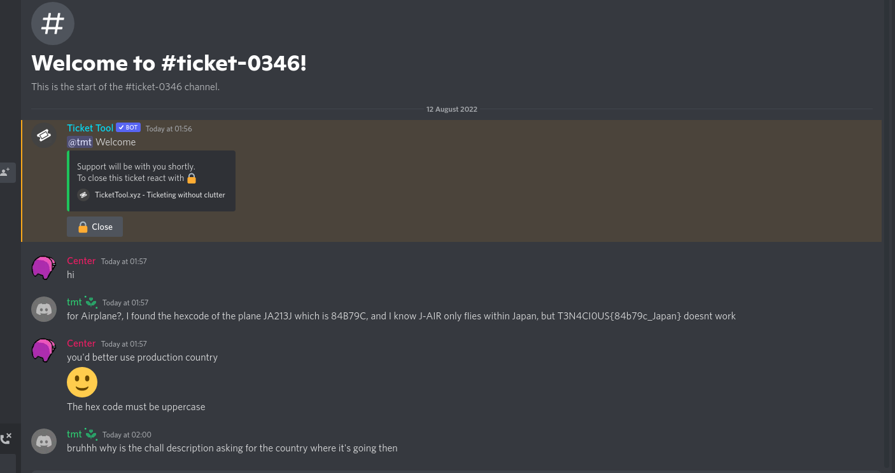
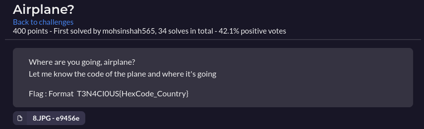

# Airplane?

* Reverse image search usign Tineye, find source image
* Later admin gives hint for plane tail code
* what the fuck do you mean it's a different plane
* what the fuck do you mean you changed the flag format to ```T3N4CI0US{HexCode_Country}```
* fine wtv
* Find the hexcode for the given plane
* Know that J-Air only flies within Japan
* surely I'll get it right
* what
* fuck it ill open a ticket
* admin: "you'd better use production country :)"
* my brother in christ what the actual fuck
* brazil???????
* i feel sick
* absolutely disgusted


